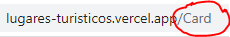

# Bienvenido a mi api hecho pór Mauricio Sierra

aca vas a ver como funciona un endpoint 

- Endpont que es:

un endpoint es una peticion que le hace el usuario de la pagina con el servidor que le redirige a otra parte de la pagina (en este caso a un json) 

por ejemplo mi endpoint de  

en esta pagina tiene 2 botones uno aparece un texto y el otro pide una solicitud al servidor que te lleva a un json con un mensaje de saludo
